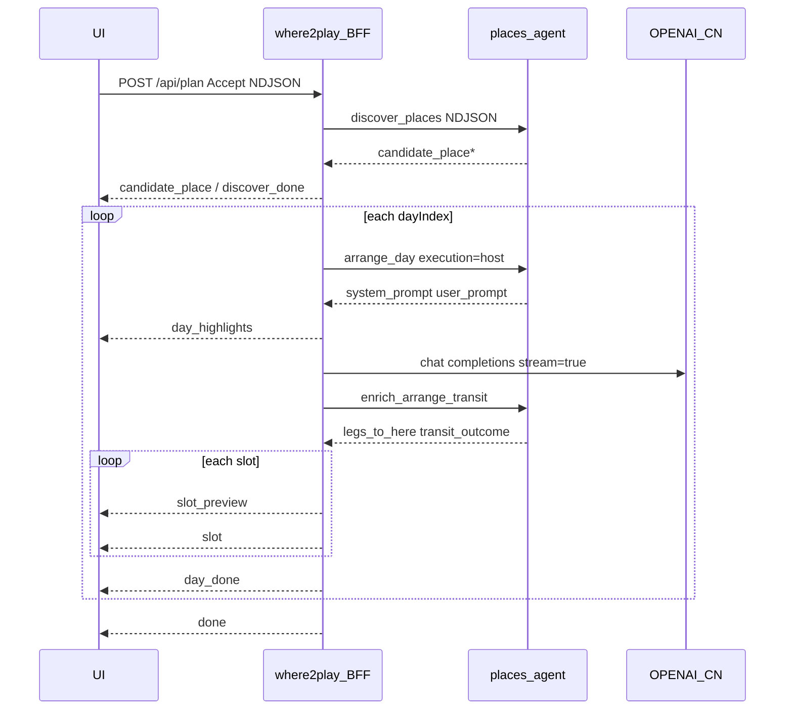

# where2play — 行程生成与 Progressive UX

**Scope:** Plan 页「生成行程」的 L1 Discover → L2 Arrange 管线、BFF NDJSON 事件、Progressive UI 四段命名与动效。  
**Related:** [`2play-design.md`](./2play-design.md) §2.4 / §3.5 · [`2play-stories.md`](./2play-stories.md) · [ADR-037](../../workspace-specs/adr/ADR-037-where2play-plan-l2-quanzil.md) · [ADR-032](../../workspace-specs/adr/ADR-032-llm-itinerary-mcp-tool-split.md) · [performance.md §3](../../1.places-agent/agent-specs/performance.md) · [ADR-038](../../workspace-specs/adr/ADR-038-discover-places-quality.md)

**Status:** Accepted（§11-P0 Progressive **已实现**；Mode H + enrich **as-built**；跨产品契约见 [ADR-043](../../workspace-specs/adr/ADR-043-chatbox-mcp-and-cross-product-closure.md)）

---

## 1. 架构真源（ADR-037 + ADR-043）

### 1.1 当前已落地（as-built，2026-08-23）

```text
L1  Discover     places-agent  POST /v1/discover_places（地图，无 LLM；热门=POPULARITY+模板，ADR-043）
L2  Prompt       places-agent  POST /v1/arrange_day execution=host（本请求不调 agent LLM）
L2  Execute      where2play    OPENAI_CN 执行 system/user prompt → 日 JSON（含 start_time）
L3  Transit      places-agent  POST /v1/enrich_arrange_transit → legs_to_here
                 UI            NDJSON 逐步揭示（slot 含时刻 + transit）
```

主路径 **不**调用 agent `arrange_day` execution=agent。  
**ChatBox MCP** 另通道：强制 agent（时刻+腿同响应）— 见 ADR-043；**不是** 2play 路径。

### 1.2 历史「目标态」说明

原 `plan-11` / `plan-13` 目标（Mode H prompt + 真 transit）**已落地为 §1.1**。下文「目标」措辞若仍出现，以 §1.1 为准。

---

## 2. Progressive UI — 四段命名

生成进行中，Plan 页中部按职责分为四段（与 mock / 实现 class 对齐）：

| 命名 | DOM / testid | 职责 | 变更 |
| --- | --- | --- | --- |
| **行程日提示** | `.plan-phase.is-busy` · `plan-phase` | 整趟大进度：「正在安排第 d/N 天…」 | **保持现状** |
| **行程细节提示** | `.plan-slot-preview` · `plan-slot-preview` | **当前正在生成**的那一条（景点 / 交通 / 餐） | 替换原「候选池 P 处 · 本趟已选用 U 处」 |
| **行程** | `.slot` / `.slot--transit` · `plan-itinerary` | 已落地的单行站点 | **一次只追加一条** |
| **加载中提示** | `.slot--pending` · `plan-slot-pending` | 下一条落地前的占位 | **同构 skeleton**，非虚线框 |

```text
┌─ 行程日提示 ─────────────────────────────────────────┐
│ 正在安排第 2/3 天…          [ 正在生成第 2/3 天… ]   │
├─ 行程细节提示 ───────────────────────────────────────┤
│ 正在加入行程：大雁塔，入选原因：…，预计游览时间：…     │
├─ 行程面板 ───────────────────────────────────────────┤
│ Day tabs · Highlights · [slot][slot][slot]…          │
│ [ 加载中提示 — skeleton 与 slot 同宽同构 ]             │
└──────────────────────────────────────────────────────┘
```

**LLM 等待期（首个 `slot_preview` 前）：** 行程细节提示用 `play.plan.arrange_planning_day`（「正在规划第 d/N 天…」），**不**再显示候选池统计为主文案。

---

## 3. 行程细节提示 — 文案契约（i18n）

所有用户可见句为 **i18n key**（CN / TW / HK / EN）。BFF 发结构化 `slot_preview`，UI 选模板插值。

| `slot_preview.kind` | i18n key | 参考（CN） |
| --- | --- | --- |
| `place` | `play.plan.preview_place` | 正在加入行程：{name}，入选原因：{reason}，预计游览时间：{window} |
| `transit` | `play.plan.preview_transit` | 正在安排下一段行程的交通：{label}，选择原因：{reason}，预计耗时：{duration} |
| `meal` | `play.plan.preview_meal` | 正在安排{meal}，推荐：{name}，推荐原因：{reason}，预计用餐时间：{window} |

**餐段 `meal` 映射：**

| block.type / 规则 | i18n 餐段 |
| --- | --- |
| `lunch` | 午餐 |
| `dinner` | 晚餐 |
| `cafe` | 下午茶 |
| `lunch` 且 start ≥ 15:00 | 下午茶 |

**`slot_preview` payload（BFF → UI）：**

```ts
type SlotPreview = {
  kind: "place" | "transit" | "meal";
  name: string;
  reason: string;
  window: string;           // "09:30–11:00" 或 "~15 min"
  mealLabel?: "lunch" | "afternoon_tea" | "dinner";
  transportLabel?: string;  // 如「捷运 + 步行」
};
```

---

## 4. BFF NDJSON 事件

在 [`plan-day-by-day.ts`](../src/core/plan-day-by-day.ts) `PlanProgressEvent` 上扩展（保留 `place` 为 `slot` 的 deprecated alias）。

| `type` | 何时 | UI |
| --- | --- | --- |
| `phase` | discovering / arranging | 行程日提示；表单 `.is-dimmed` |
| `candidate_place` | discover 流 | Discover 同态候选 |
| `discover_done` | L1 结束 | （可选）内部计数；**不作** arrange 主文案 |
| `arrange_day_start` | 日开始 | 预建 Day tabs；触发「规划当日…」 |
| `day_highlights` | theme 已知 | Highlights 骨架 |
| **`slot_preview`** | **每条 slot 落地前** | **行程细节提示** |
| **`slot`** | **每条 slot 落地** | **行程** +1 |
| `place` | alias of `slot` | 兼容旧客户端 |
| `day_done` / `progress` | 日完成 | 刷新 itinerary；自动切下一 Day tab |
| `done` | 全部完成 | Updated；去掉 progressive 壳 |
| `error` | 失败 | i18n key |

**顺序（单日）：** `arrange_day_start` → `day_highlights` → (`slot_preview` → `slot`)\* → `day_done`。

---

## 5. L2 管线（BFF）

### 5.1 拉 prompt（Mode H）

**目标（P1 / `plan-11`）：**

1. `POST` places-agent `/v1/arrange_day`，`execution: "host"`  
2. 响应：`{ execution: "host", system_prompt, user_prompt, output_contract, candidates_slim }`  
3. Agent **不**在本请求内调用 OPENAI_CN（agent Feature **35** 已支持）

**当前 as-built（2026-08-23）：** BFF [`fetchArrangeHostPrompts`](../src/core/plan-arrange-llm.ts) → `POST /v1/arrange_day` `execution: "host"`；本地 [`buildArrangeDayMessages`](../src/core/plan-arrange-llm.ts) **仅单测**。W2d live 签收前勿标 MVP-3 Done。

### 5.2 OPENAI_CN 执行

- BFF `OPENAI_*` → OPENAI_CN `chat/completions`（与行程助手同源，[ADR-036](../../workspace-specs/adr/ADR-036-where2play-assistant-quanzil.md)）
- **AbortSignal 110s**（[ADR-032](../../workspace-specs/adr/ADR-032-llm-itinerary-mcp-tool-split.md)）→ `errors.arrange_timeout`
- **P2：** `stream: true`，增量 parse JSON blocks，首个 block 尽早 `slot_preview`
- **P0：** 非流式等满 JSON → 解析后 **逐步** emit（见 §5.4）

### 5.3 统一 slot 序列

导出 **`expandArrangeDayToSlots(blocks, criteria, dayMeta)`**（[`itinerary-map.ts`](../src/core/itinerary-map.ts) 复用 `mapLlmDayBlocks` + 首尾交通合成）。

- Progressive `slot` 与 `day_done` 的 `itinerary.days[].slots` **必须同一函数**，避免最终跳变
- 交通：日首 `from_origin`、日尾 `to_destination`、站间合成（与 `criteria.transport` 一致）

### 5.4 逐步节奏

每对 `slot_preview` → `slot`：

- BFF `await sleep(380ms)`（可 env 配置；仅 post-parse staged 路径）
- UI **reveal 队列**：同帧收到多条时仍逐条展示
- `prefers-reduced-motion: reduce`：无 delay、无 shimmer

### 5.5 L2 业务约束（ADR-038 P0）

- 一日一主题；同区连游；禁止同日堆同一 landmark cluster
- 理由可含估计步行/打车（不调 navigate）
- 跨天 `exclude_names` / `usedNames` 收缩候选

---

## 6. UI 实现要点

**文件：** [`plan-page.tsx`](../src/ui/plan-page.tsx) · [`plan-itinerary-view.tsx`](../src/ui/plan-itinerary-view.tsx) · [`app/mockup.css`](../app/mockup.css)

| 项 | 行为 |
| --- | --- |
| 行程日提示 | 不变：`.plan-phase.is-busy` + 钮 `.is-generating` |
| 行程细节提示 | `slotPreview` state；`slot_preview` 更新；`.plan-slot-preview` |
| 行程 | `liveSlots` 每次 +1；`day_done` 前仅 live，完成后 merge itinerary |
| 加载中提示 | `dayPending`；`.slot--pending` skeleton（见 §7） |
| 删除 | arrange 阶段 `arrange_pool_summary` **作主文案** |

**切日：** `day_done` 后 `focusDayIndex = min(dayIndex + 1, daysTotal)`；未排日 tab `Day k · 排队`（`play.plan.day_n_queued`）。

---

## 7. 加载中提示 — 视觉（Frontend Design）

**问题：** 现行虚线框 + 单行「下一站加载中」与真实 `.slot` 脱节。

**方案：** `.slot--pending` 与 `.slot` **同构 skeleton**：

```text
[ 时间列 shimmer ] [ thumb 占位 ] [ 两行骨架条 ]
                  下一站加载中（小字，非主视觉）
```

- 微光扫过 `--glaze` 8% 透明度；**不用**灰色虚线大框
- 与上一条 `.slot.is-entering` 间距一致
- `aria-busy="true"` · `data-testid="plan-slot-pending"`
- `prefers-reduced-motion`：静态占位，无 shimmer / pulse

**等待动效（已有，保持）：**

- `.plan-phase.is-busy` — 文案 pulse
- `.btn.is-generating` — 绿钮呼吸光
- 不增加 indeterminate 进度条

Mock SoT 同步：[`ui-mockup/06-plan-arrange.html`](./ui-mockup/06-plan-arrange.html) 等。

---

## 8. 数据流



---

## 9. places-agent 能力（Mode H）— **已交付**

| 项 | 内容 | 状态 |
| --- | --- | --- |
| HTTP | `POST /v1/arrange_day` + `execution: "host"` | **Done**（agent Feature **35**） |
| 响应 | `{ execution, system_prompt, user_prompt, output_contract, candidates_slim }` | **Done** |
| 共享 | `buildSchedulePrompt` — MCP Mode H 与 HTTP 共用 | **Done** |
| 测试 | host 路径零 OpenAI（TC-M8-H35 / M35） | **Done** |

**2play 增量（`plan-11`）：** BFF 已改调上述 host 接口；本地 `buildArrangeDayMessages` 仅测试保留。

---

## 10. 分期交付

| 阶段 | 内容 | 验收 | 状态 |
| --- | --- | --- | --- |
| **P0** | `expandArrangeDayToSlots` + `slot_preview`/`slot` + 四段 UI + pending + i18n | 逐步揭示；细节提示随 kind | **已实现** |
| **P1** | **2play** 改拉 agent `execution=host` prompt（**MVP-3** / `plan-11`） | Prompt 单一真源；去掉本地 duplicate；地标 + 交通偏好 | **Implemented**（W2a；live AC3→W2d） |
| **P2** | OPENAI_CN `stream: true` + 增量 JSON parse（**MVP-3** / `plan-12`） | 首个 `slot_preview` 在整日 JSON 完成前 | **Implemented**（W2c） |
| **P1b** | 真 transit 消费（**MVP-3** / `plan-13`） | `legs_to_here`；非一律 15min | **Implemented**（W2b） |

**建议实施顺序：** P0 ✓ → **P1（2play）** → P2。

---

## 11. 测试

| 层 | 内容 |
| --- | --- |
| Agent | `buildSchedulePrompt` 快照；`execution=host` 无 LLM 调用 |
| BFF | mock prompt + mock OPENAI_CN → `slot_preview` 先于 `slot`；`expandArrangeDayToSlots` 含 transit |
| UI | preview 文案随 kind；一次只多一条 slot；reduced-motion 无动画 |
| E2E | 生成行程：细节提示变化；pending skeleton 可见 |

契约测：**不得**断言 agent `/v1/arrange_day` **execution=agent** 为 2play 默认路径（ADR-037）。**MVP-3** 起须断言每日 **execution=host** 被调用（mock 或 spy）。

---

## 12. 范围外

- Token 级在 UI 展示 LLM 原文
- 候选池统计作为 arrange 主文案
- 默认回退 agent `arrange_day` execution=agent
- Indeterminate 进度条
- 并行多日 arrange
- 生成前编辑候选

---

## 13. i18n 键清单（新增 / 变更）

| Key | 用途 |
| --- | --- |
| `play.plan.arrange_planning_day` | LLM 等待期行程细节提示 |
| `play.plan.preview_place` | 景点 |
| `play.plan.preview_transit` | 交通 |
| `play.plan.preview_meal` | 餐厅（含 {meal} 餐段） |
| `play.plan.meal_lunch` / `meal_afternoon_tea` / `meal_dinner` | 餐段标签 |
| `play.plan.next_stop_loading` | pending 小字（已有，保留） |

**Deprecated 作主文案：** `play.plan.arrange_pool_summary`（可保留作调试或 LLM 前一行小字，默认隐藏）。

---

## 14. 实现文件索引

| 区域 | 路径 |
| --- | --- |
| BFF 编排 | [`src/core/plan-day-by-day.ts`](../src/core/plan-day-by-day.ts) |
| L2 OPENAI_CN | [`src/core/plan-arrange-llm.ts`](../src/core/plan-arrange-llm.ts) |
| Slot 映射 | [`src/core/itinerary-map.ts`](../src/core/itinerary-map.ts) |
| Plan UI | [`src/ui/plan-page.tsx`](../src/ui/plan-page.tsx) · [`src/ui/plan-itinerary-view.tsx`](../src/ui/plan-itinerary-view.tsx) |
| 样式 | [`app/mockup.css`](../app/mockup.css) · [`ui-mockup/assets/mockup.css`](./ui-mockup/assets/mockup.css) |
| Agent prompt | `1.places-agent`（P1） |

---

## 15. 与 `2play-design.md` 的关系

- **本文件：** 行程生成 **管线 + Progressive 四段 UI + 事件契约** 的专项设计（Mode H / ADR-037）。
- **`2play-design.md` §2.4.1 / §3.5.3：** 页面级摘要与 mock 索引；细节以 **本文件为准**。
- **`2play-stories.md` `plan-10`：** 可验收 AC；**`2play-test-plan.md` §5.4：** 测试矩阵。
- 冲突时：**mock 视觉** > 本文件 **交互契约** > `2play-design` 摘要。
